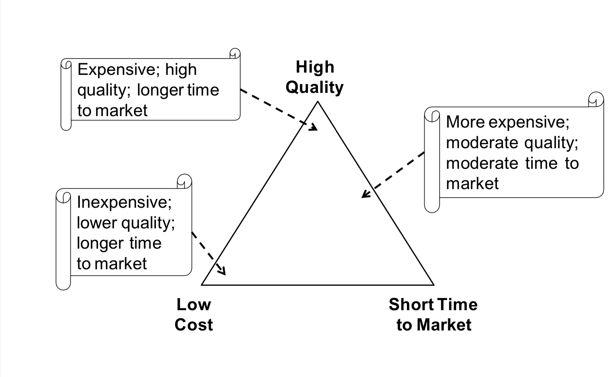
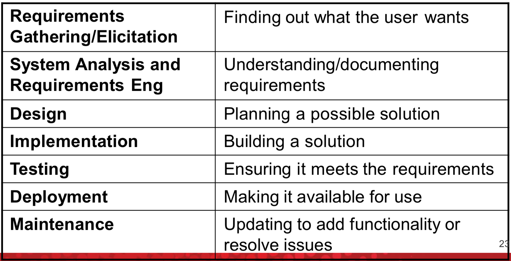
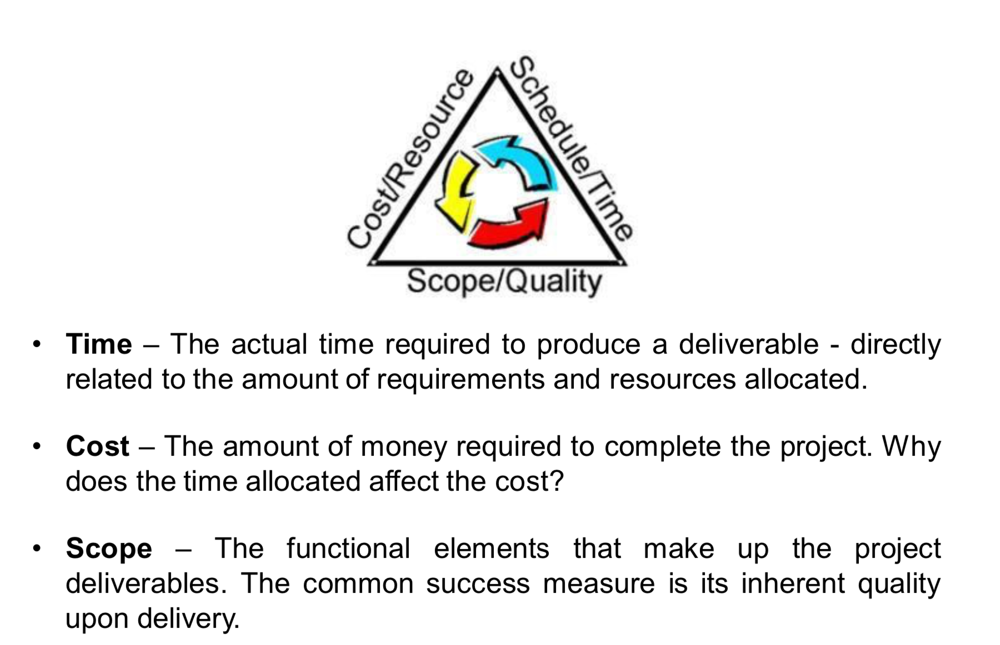
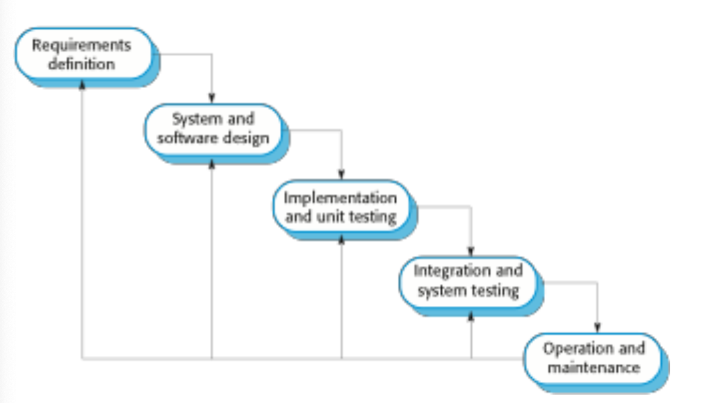
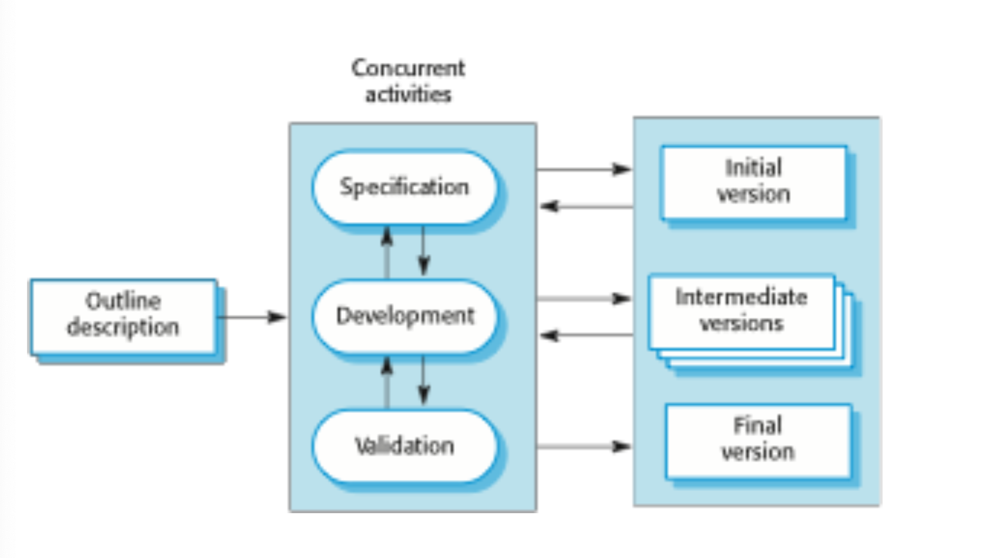
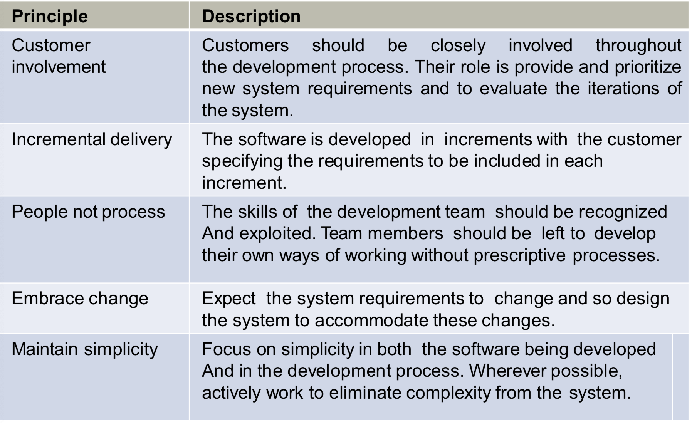
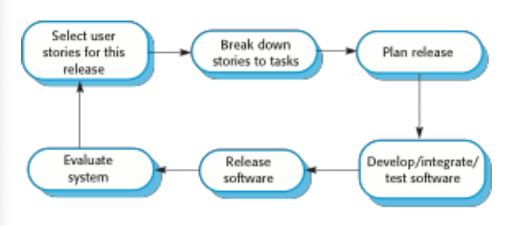
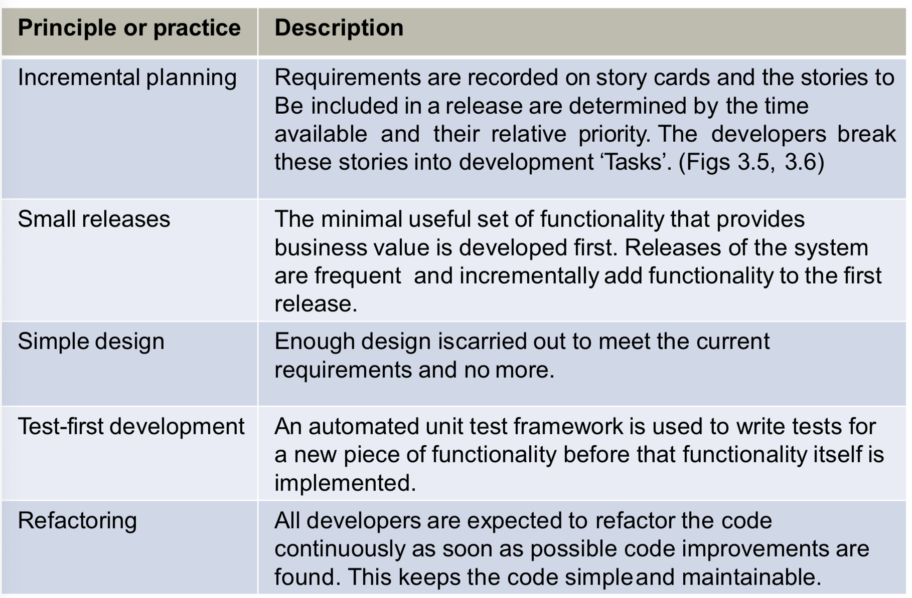
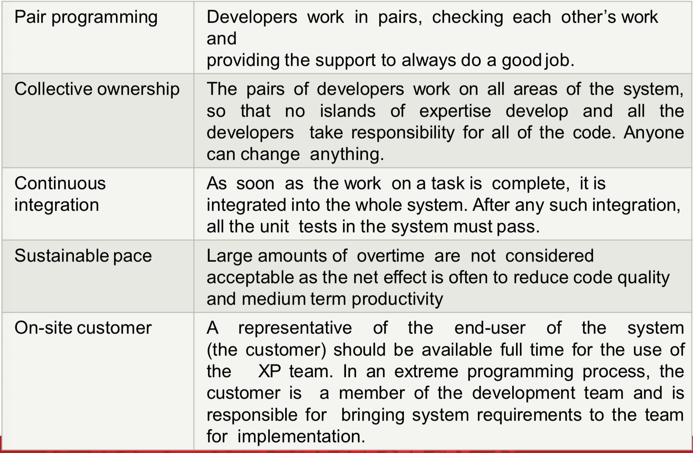
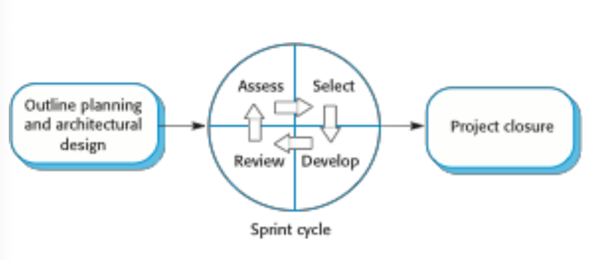

# Process and Tools

### Quality Triangle

### Why SE Process and Tools

**What are some characteristics of modern software construction**

- Shorter iteration Cycles

**How does process help?**

- Reduce risk of failure
- failure is quick
- Feedback is recieved quickly, and solutions can be provided based on changing requirements and needs of the clients

**How do tools help?**

- Automation: reduce human error
- Collaboration

**What else do we need?**

- Characteristics of the team-members: commitment, success of the team

As well as reducing Risk, we also reduce Uncertainty

- Time required to complete a project
- Availability and cost of key rsources
- Timing of solutions to technological problem
- Macroeconomic variables
- The whims of clients
- Actions taken by competitors

### Why do project fail

- What is failure:
  - PRoject is not delivered on time
  - The cost is over budget
  - The system does not work as required

- Failure to pay attention to detail particularly during the specification phase of the project and to properly manage technical issues were the root causes of these accidents.

### Software development lifecycle

### Other parts of the life cycle

**Project scoping**

- Deals with putting limits on how much you want to create/clearly specifying what you want to achieve
  - You may decide to leave network play out of a game.
  - An accounting pacakge may be limited to support only one database back-end
  - A music player may only play songs encoded in MP3 format
  - ...

### Project Management Triangle

# Software Process Models

Software process model is an abstract representation of a process. It presents a description of a process from a particular perspective.

### Waterfall model

**Problems**:

- Difficult to accomodate change after the process is underway. In principle, each phase has to complete before moving on to the next phase.

- Inflexible partitioning makes it diffficult to respond to changing customer requirement
- Model is only apporpriate when the requirements are well understood and changes are limited during the design process
- Mostly used for large system engineering project where a system is developed at several site.

### Incremental development

**Benefits**:

- The cost of accomodating changing customer requirements is reduced. The amount of analysis and documentation has to be redone is much less comparing to waterfall model.

- It is easier to get customer feedback on the development on the development work that has been done
- More rapid delivery and development of useful software to the customer is possible.

### Agile method

**Principles**

**Method applicability**

Product development where a software company is developing a small or medium-sized product for sale

Custom system development within an organization where there is a clear commitment from the customer to become involved in the development process and where there are not a lot of external rules and regulations that affect the software

**Problem**:

Because it’s focusing on small team, there are problems in scaling agile methods to large system.

### Extreme programming (XP)

New versions may be built several times per day

Increments are delivered to customers every 2 weeks

All tests must be run for every build and the build is only accepted if tests run successfully 

### **Release cycle**

**Extreme programming practices**

### **Process activities**

4 basic process activities of:

- Specification
- Development
- Validation
- Evolution

### Scrum

Is a general agile but focus on managing iterative development rather than specific agile practices.

1. The inial phase is an outline planning phase. Establish general project’s objectives and design software architecture
2. Followed by a series of sprint cycles, where each cycle develops an increment of system
3. Project closure phase wraps up the project, completes required documentation such as system help frames and user manuals and assesses the lessons learned from the project.

**The Scrum process**

**The Sprint cycle**

Fixed length, normally 2-4 weeks. Correspond to the development of a release of the system in XP

The starting point for planning is the product backlog, which is the list of work to be done on the project

**Scrum team**

- Scrum master
- Product owner
- Developers.

**Benefits**

- Products is broken down to small task => Easier to manage
- Unstable requirements do not hold up progress
- Customers see on-time delivery
- Trust between customers and developers is established

