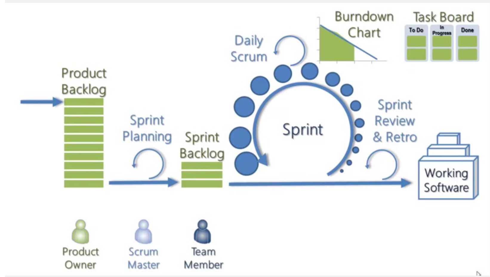

# Scrum and User stories

### Agile

**Framework for delivering products quickly and efficiently**

It encompasses set of exciting new practices and techniques that make product development more iterative.

Relies on lean governance (management) as opposed to more traditional techniques that rely on heavyweight governance

Is about empowering the team and getting closer to what the customer wants

**Manifesto**

1. The highest priority is to satisfy the customer through early and continuous delivery of product
2. Changes are welcome, even late in development
3. Deliver working product frequently, typically on the order of weeks
4. Build projects around motivated individuals
5. Emphasize face-face conversation
6. Working product is the primary measure of progress
7. Continuous attention to technical excellence is a must
8. Simplicity a great virtue
9. The best designs emerge from self-organizing teams

### What’s scrum

- Agile gives you the basic orientation but scrum lets you bring Agile to your organization and make it works.

### What is involved

- The customer tells the Scrum Team **what’s needed through requirements. In Scrum, requirements are called stories**
- A **story is a high-level definition of a requirement**, containing just enough information so the developers can produce a reasonable estimate of the effort to implement it

- **The** **Scrum Team takes the supplied stories and breaks them down to specific tasks**, which is given a time estimate (story points).. These tasks are then kept track of the sprint backlog.

## Meetings

1. Daily scrum meeting
   - Around 15 mins
   - What did u do since last Scrum?
   - What will you do next Scrum?
   - Do you have any roadblocks preventing you from doing your work?
2. Sprint Planning meeting
   - Every 7-30 days
   - Select what work is to be done
   - Prepare the sprint backlog that details the time it will take to do that work
   - Identify and communicate how much of the work is likely to be done during the current sprint
   - 8 hours limit
3. Sprint review meeting
   - Comes after the sprint execution
   - Should have a live demo
   - Product owners **reviews commitments made at the Sprint Planning Meeting**
   - **Declare which items she now considers done**
4. Retrospective meeting
   - **The team inspect their behaviour and take action to adapt it for the future sprints**
   - What went well?
   - What went badly / what can we improved?
   - What did we learn
   - What is still confusing?
