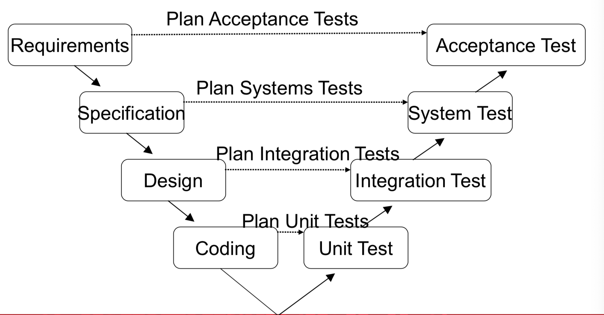
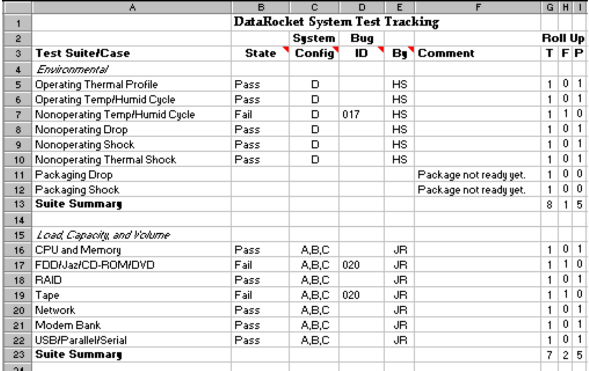

# Testing and Management

## Testing

1. **Purpose**:
   - Demonstrate that the software meets requirements
   - Discover aspects that has not met the requirement
2. Can test **prove that we have removed all bugs?**
   - **NO** - It can **only proves that there are bugs.**
   - But it can increases the confidence that software will work as intended.

### Cost of fixing Errors

Low to high:

1. Design: 1x
2. Implementation: 6.5x
3. Testing: 15x
4. Maintenance: 100x

> Better be fixed at testing.

### V-Model of SDLC[^1]



[^1]: Software Development Life Cycle.

---

## Test Planning

- Have to make surre that all aspects of the software are tested.
- 1 Features - 1 to many test casse, to exercise the feature thoroughly.
- Must specified into either `pass` or `fail`
  - **Start** from a `known state` / configuration
  - Clearly **specify the steps** to perform a test
  - **Specify the expected result** which means test “passed”

---

## Test cases

A test case is designed to **test 1 aspect of the system**

- Use **use-cases or stories** to design test case at the system level

- Functional requirements may be used to identify different data values

  (Examples: what if password < 8 chars)

- Must be *reproducible* - the **setup** and the **steps to perform the tests** must be **precise**.

### Managing Test Case

1. Could be documented in
   - Test document / Spreadsheet
   - Task tracking tools, e.g Trello
   - Specialised system, LeanTesting
2. Test case status should include (at minimum)
   - Last date/time the test was run
   - Whether it passed or failed

### Test case summary example



---

## Mock objects[^2]

Useful when we haven’t built all the functionalities but needs an object for the example.

What we can do is to make a mock object to <mark>mimic the functionality</mark>

Examples:

- Test user login methods without using database
- Test GUI Update functioanlity without using database.

[^2]: Refer to [lec5.md](lec5.md#mockobject)


### Mock Object (Code Example)

```java
public class MockConnection implements AuthConnection {
		public String requestedUsername;
 		public String requestedPassword;
		public boolean authorizationResult;
    public boolean isUserValid(String uname, String pword){
        this.requestedUsername = uname;
        this.requestedPassword = pword;
        return authorizationResult;
    } 
}
```

```java
@Test
public void testLoginDialogSuccess {
   AuthChannel mock = new MockConnection();
   mock.authorizationResult = true;
   LoginDialog dlg = new LoginDialog(mock);
   dlg.setUsername(“lc”);
   dlg.setPassword(“mypwd”);
   dlg.submit();
	 assertTrue(dlg.isAuthorized());
   assertEqual(“bob”,mock.requestedUsername); 
   asswetEqual(“mypwd”,mock.requestedPassword);
}
```

---

## Release Testing

- Is the process of testing a particular <mark>release of a system</mark> that is <mark>intended to use outside of the development team.</mark>

  - The goal is to convince supplier of the system that is good enough to use.

    > Release testing has to show that the system is delivered according to its functionality and therefore does not fail during normal use

- Release testing us usually black-box testing process where tests are only derived from system specification.

### Release testing and system testing

- Release test is a form of system testing
- Differences:
  - A **seperate team that has not been involved in the system development, should be responsible for release testing**
  - System testing by the development team should focus on discovering bugs in the system. The objective of the system testing is to check that the systems meets its requirement that it’s good enough for exterenal use.

---

## Requirements Test

- Set up cases that system are expected to handle and test it.

### Requirement based testing

- Requirements-based testing involves **examining each requirement and developing tests for it.**

---

## Performance testing

- Where **non-functional** qualities  of the system will be test on such as performance and reliability

- Will be based on the features that the system currently has.

- Performance tests usually involve planning a series of tests where the load will be increased gradually until the system performance will be unacceptable.
- **Stressing test** is a form of performance testing where it tries to stress out the system by overloading toi test it failure behavior.

---

## User Testing

> Users or customers provide input and advice on system testing

User testing is essential, even when comprehensive unit system and release testing have been carried out.

**Why user testing is essential?**

- Because the user working behaviors has important impact on the reliability of the program’s performance.

### Types of user testing

| Type               | Definition                                                   |
| ------------------ | ------------------------------------------------------------ |
| Alpha testing      | Users work with the development team to test the software at the developer’s site |
| Beta testing       | A release of  the software is made for user  to experience. User then can raise problems or report bugs if they found any. |
| Acceptance testing | Customers test a system to decide whether or not it’s ready to be deployed in a customer environment. |

### Stages in acceptance testing process

1. Define acceptance criteria (in the User Stories)
2. Plan acceptance testing
3. Derive acceptance tests
4. Run acceptance tests
5. Negotiate test results
6. Reject/accept system

### Agile methods and acceptance testing

- In agile, because customer is part of the development team and responsible for making decisions on the acceptability of the system.

- **Tests are defined by the user** and are integrated with other tests in that they run automatically when changes are made.

- **Main problem:**

  Whether or not the included user are “typical” and can represent the interests of all system stakeholders.

## Key points on testing

- Testing cannot demonstrate that there are no remaining faults
- It’s the development team responsibility to develop the testing. However, a separate team is responsible for testing a system before it is released to customers.
- Development testing includes unit testing, in which individual objects were tested. Component testing in which you test related groups of object and system testing.
- Test-first development is recommended.
- Testing scenario should be derived from usage scenario.

----

## Issue tracking

- A TO-DO list
  - Also be used for bugs, fix/issues to address, along with a clear  steps to reproduce, etc
- Communicate issue from QA to developers
- Communicate issues from users to developers.
- Help to manage bugs/issues and provide a workflow for assigning issues to specific team members.

### Issue report lifecycle


Simplified version:


- Open:
  - New
    - User has reported issue, not yet looked at by a developer
  - Accepted
    - Accepted to be a valid issue
  - In progress
    - Being worked on by a developer
  - Need more info (NMI)
    - Waiting for more info from user.
- Closed:
  -  Fixed;
  - Verified Fixed
    - QA or user has verified that the fix worked
  - Invalid
  - Duplicate
  - Will not fix / known shippable
- Severity:
  - Scope of the problem, does it crash, block progress, is there workaround or is it just annoying
- Priority
  - 1 highest - 5 lowest
  - Could be by user’s or developers.

### Severity Vs. Priority

| Severity: Effect of failure on the system          | Priority: effect of failure on customer/ user |
| -------------------------------------------------- | --------------------------------------------- |
| 1. Loss of data, hardware damage or a safety issue | 1. Complete loss of value                     |
| 2. Loss of functionality with no work around       | 2. Unacceptable loss of value                 |
| 3. Loss of functionality with a work around        | 3. Possibly acceptable reduction in value     |
| 4. Partial loss of functionality                   | 4. Acceptable reduction in value              |
| 5. Cosmetic or trivial                             | 5. Negligible reduction in value              |

>  It’s easier to assign severity but harder to assign priority. Priority can be adjusted during bug triage.

