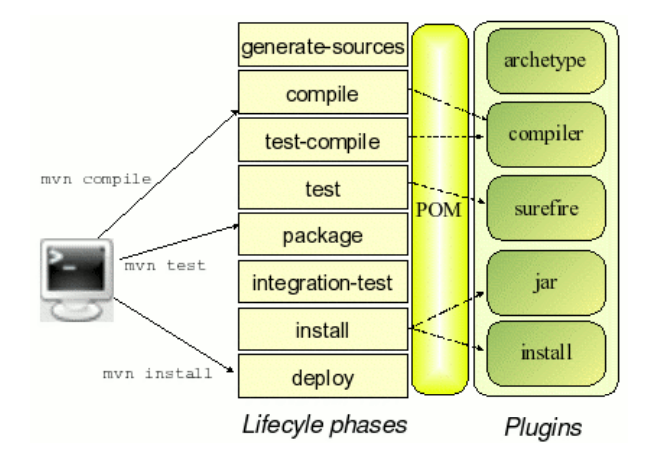

# Build Configurations

## Builds

- Compile source code
- Copy resources
- Generate Documents
- Generate version number
- Generate installation program / manifest[^1]
- Compress / archive

> Build time increases significantly in terms of complexity. Thus we need to automate to reduce the errors.

### CI&CD Build

- Run automated tests
- Upload to distribution server
- Generate source code / bindings, …

[^1]: Type of document

### Build Configurations

**Why?**

- Often you’re not creating just one versions:
  - Might need different build for different operating systems, etc..
- Sometimes these different builds require a different packaging style
  - E.g distributing a JAVA program on OSX or Windows/ Linux
- Sometimes source code needs to be different
  - Features for different users, drivers.

### Build Incrementally

The whole system might takes hours to recompile. 

Find the **minimum that’s need to be done to rebuild the system** so you don’t have to wait for the whole thing to compile if only compile 1 line.

## Apache ants

Build tool for java inside eclipse

- You wanna avoid typing stuff like

  ```bash
  javac -classpath lib/junit-4.0.jar -sourcepath src -d
  classes
  
  java -cp classes:lib/junit-4.0.jar myapp.Main
  ```

  Because this is not incremental build

- Apache will perform tasks according to the build file `build.xml`

  Which looks something like this:

  ```xml
  <project name="MyProject" default="compile" basedir=".">
  <description>
  simple example build file
  </description>
  <!-- set global properties for this build -->
  <property name="src" location="src"/>
  <property name="build" location="classes"/>
      
  <target name="compile" description="compile the source">
  <!-- Compile the java code from ${src} into ${build} -->
  <javac srcdir="${src}" destdir="${build}"/>
      
  </target>
  </project>
  ```

  `<project>` Define the project

  `<target>` a task that can be performed

  `<property>` variables


### Commonly defined target:

- prepare
- build
- clean
- dist
- doc
- test
- run

To link dependencies:

```xml
<target name="prepare">
<target name="build" depends="prepare">
<target name="run" depends="build">
<target name="test" depends="build">
<target name="dist"
depends="clean,build,test">
<target name="doc" depends="prepare">
```

## Apache Maven

### Apache Ant vs Apache Maven

> **Maven:** will keep the local repository where the library will be. And it **keep the local repository up to date with the remote repository**. If it cannot find, then it will go online to download it.

While **ant you have to specify the directory.**

> Maven is a software project management and comprehension tool
>
> - Automatic build tool
> - Focused on simplicity
>   - Creation - generates intelligent starters
>
> - Covers Build
>   - Build management
>   - Testing
>   - Release versionming
>   - Deployment
> - Project oriented
> - Convention over Configuration
> - Dependency management
> - Extensible through plug-ins
> - Reuse through centralized repositories

### Project Obriented Builds

Maven models build as **Project Object Model** (POM)

Define as XML in pom.xml

### Maven lifecycle




## Other Build tools

**Apache Ivy**

- Dependency Management, mostly used together with Ant

**Gradle**

- Groovy based
- Becoming popular
- More flexibility
- Better support for multi-project builds

### For PHP

**Composer**

- Equivalent to Apache Ivy
- Dependency Management

**Phing**

- Equivalent to Apache Ivy