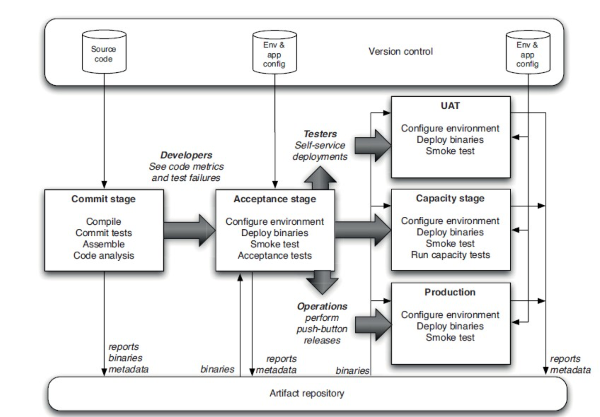

# CI/CD - Continuous Integration and Dvelopment

> **Benefits**:
>
> - Keep the team in sync, remove integration delays
>
> - No gap between operation and developments (for Devops)
> - Automated test means reliable product
> - Quicker respond to changes without error
> - Remove the stress of system upgrade.

## Principles of software delivery

- Automate almost everything
- Keep everything in version control
- **Done means release**
- Continuous Improvement

## Configure management

- refers to the **process** which all artefacts relevant to your project.
- Your configuration management strategy will determine how you manage all the changes happen within the project
- It also **helps to govern the team collaborates**
- **Version control** is just one of the step

### Configuration Management Steps

1. Version Control
2. Managing dependencies
3. Managing software configuration
4. Manage your environment

## Continuous integration

Make sure that all the time, the product is ready to deploy

### Implementing continuous Integration

**Before start**

1. Double check if you have everything in version control including tests
2. Automated Build
3. Agreement of the team

**Basic Continuous integration system**

1. Check to see if the build is already running. If so, wait for it to finish. If it fails, you’ll

   need to work with the rest of the team to make it green before you check in.

2. Once it has finished and the tests have passed, update the code in your development environment from this version in the version control repository to get any updates.

3. Run the build script and tests on your development machine to make sure that everything still works correctly on your computer, or alternatively use your CI tool’s personal build feature

4. If your local build passes, check your code into version control.

5. Wait for your CI tool to run the build with your changes.

6. If it fails, stop what you’re doing and fix the problem immediately on your development machine—go to step 3.

7. If the build passes, rejoice and move on to your next task.

### Prerequisite for CI

- Check in regularly and frequently
- Create a comprehensive automated tests
- Keep the build and test process short
- Managing your development work space

### Using CI Software: Basic Operation

Continuous integration software has **two components**

- **a long-running process which can execute a simple workflow at regular intervals**
- provide **a view of the result**s of the process that have been run, **notifies you of the success or failure** of your build and test runs, and provides access to test reports, installers,...

Show a list of builds and test to show the clients and testers

Uses commands (Jenkins) or Web interface (Travis)

### CI Essentials

- Don’t check in on a broken build
- Always run all commit tests locally before commiting, or get your CI server to do it for you
- Wait for commit tests to pass before moving on
- Always be prepared to revert to the previous revision
- Time-box fixing before reverting
- Don’t commenting out failing tests
- Take responsibility
- Test-Driven Development.

## Implementing a testing strategy

## Deployment pipeline

Changes through the process

A Basic Pipeline

