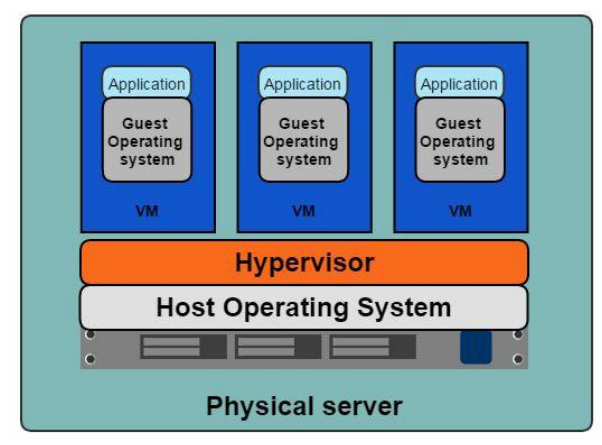
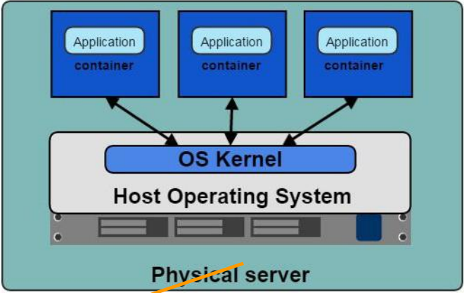
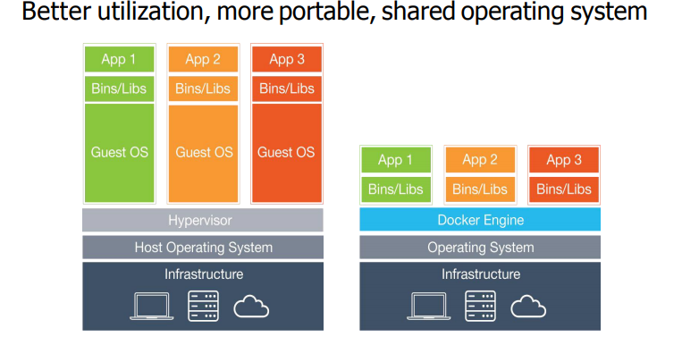
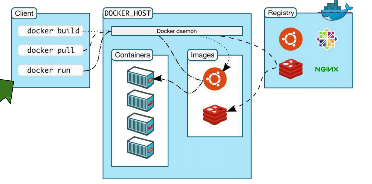

# Docker

> The idea is built a specific environment for 1 application
>
> Is a container platform

## Different between container and traditional VM

### Traditional VM



The traditional virtual machine needs to have an operating system to run the application.


### Container



Container however runs differently that it shares the same machine as the host operating system

- Lightweight, faster
- No need guest OS
- Less CPU, RAM, Storage required
- More containers per machine than VMS
- Greater portability
- Easy to manage as they share common OS
- Better way to develop and deploy microservices compared with VMs




Check docker infomation

```bash
docker info
docker version
```

Run docker

```bash
docker run hello-world
```

## How docker works




Check what’s running in docker

```bash
docker container ls
```

> ```bash
> docker container ls -all
> ```
>
> list all the commands in the containers

Check what image you have

```bash
docker image ls
```

Check what container for what image

```
docker ps -a
```

> `-a` includes those stopped container

To remove an image, you need to remove the container ID first, and then delete the image using

```
docker rmi imagename
```


## Open terminal on ubuntu

```bash
docker run -i -t ubuntu:14.04 /bin/bash
```

## Use detached mode to run in the background

```bash
docker run -d ubuntu:14.04 ping 127.0.0.1 -c 50
```

> `-d` stands for deamon/detach
>
> ping to see if it’s alive or not

### To switch to attached mode

```
docker attach <container_id>
```

## Stop a docker

```bash
docker stop <container_id>
```

## Check if a container exited

```bash
docker ps -a -f status=exited
```

## Build the docker

Must have a dockerfile in the folder to build

```bash
docker build --tag=tagname
```

and then you can start it with `docker run`

```bash
docker run -p 4000:80 friendlyhello
```

> Port 4000 on your machine but 80 for docker
>
> You can add -d to run daemonly

