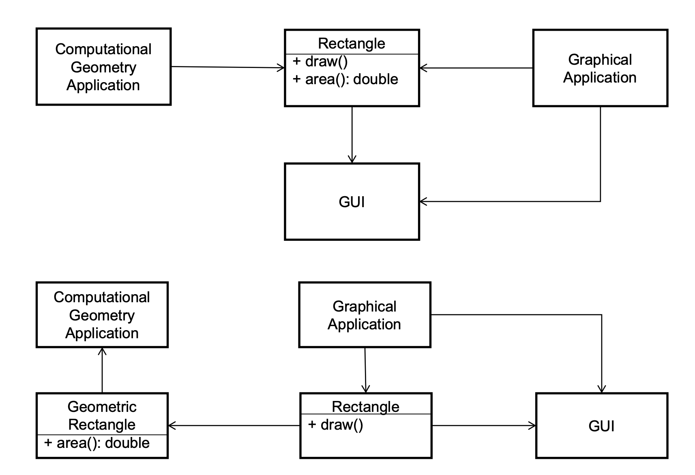
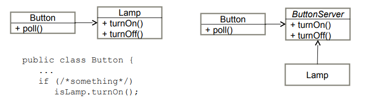

# Design and the SOLID principle

## Design characteristic

| Characteristic         | Definition                                                   |
| ---------------------- | ------------------------------------------------------------ |
| Coherence              | Does the architecture have a logical structure, with elements working together to form a whole? |
| Cohesion               | Are functions related to eachother                           |
| Consistency            | Are they consistent                                          |
| Coupling               | How strong elements are                                      |
| Extensibility          | Will it be easy to extend to new functions in the feature?   |
| Functional flexibility | Can it easiliy be changed in term of functionality           |
| Generality             | Are mechanisms and decisions in the architecture as general as practical |
| Interdependency        | What portion of processing steps involves interactions between elements, as opposed to within an element |
| Seperation of concerns | Are internal elements responsible for distinct parts of system’s operation? |
| Simplicity             | Is the solution the simplist one?s                           |

### Symptoms of poor design

| Symptom             | Definition                                                   |
| ------------------- | ------------------------------------------------------------ |
| Rigidity            | The system is hard to change because every change forces more change |
| Fragility           | The system may break in multiple places due to change in one place |
| Immobility          | Parts could be useful in other system but effort risk to seperate from original system is too much |
| Vicosity            | Doing things right is harder than doing things wrong         |
| Needless Complexity | Some elements are not useful                                 |
| Needless repition   | A lot of repeat code                                         |
| Opacity             | The system is hard to read and understand                    |

 ## Desirable Design characteristic

- High extensibility
- High reusability
- Use design principles and design patterns


## The SOLID Principles

#### **Single Responsibility Principle (SRP)**
  - A class should only have one reason to change
    - Responsibility = What a class does
    - The more the class does, the more likely it will change
    - The more a class changes, the more likely we will introduce bugs
  - 

#### Open-Closed Principle (OCP)

Software entities (classes, modules, functions, etc) should be **open for extensions but closed for modification**
- Open for extension = behaviour can be extended
- Closed for modification = extending behaviour does not result in changes to the code
- Rely on abstractions: abstract classes, interfaces

  <u>Example:</u>

  > The use of abstract classes

  ```java
  abstract class Shape {
      abstract void draw();
  }

  void drawAllShapes(ShapeList[] list) {
      ...
          list[i].draw();
      ...
  }
  ```
  
  


#### Liskov substitution principle (LSK)

Sub classes should be able to substitute the super classes

<u>Example:</u>

```java
public class Square extends Rectangle {
    public Square() {
        ...
    }

    public void setHeight(int h) {
        super.setHeight(h);
        super.setWidth(h);
    }
}
```


####  Interface Segregation Principle (ISP)

Clients should not be forced to depend on method that they do not use

- Split into multiple modules / classes OR define specific interfaces for specific puirposes that the clients implement

####  Dependency Inversion Principle (DIP)

High-level modules should not depend on low-level modules; both **should depend on abstractions**

Abstractions should not depend on details, ==details should depend on abstractions==

.

> In here `Lamp` is the abstraction class, `ButtonServer` will control the `Lamp` which is triggered by `Button`