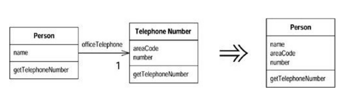
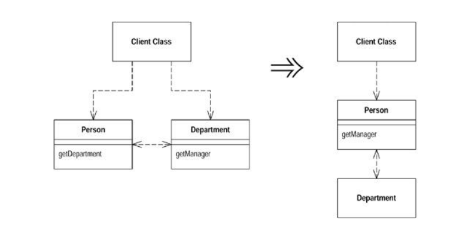
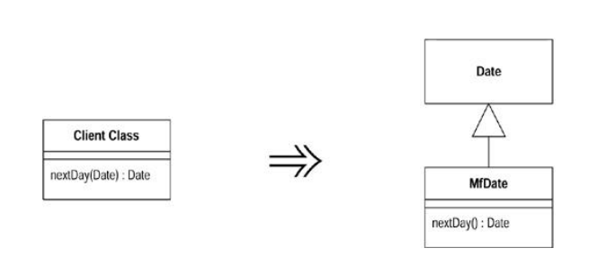
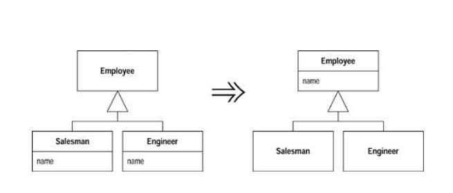
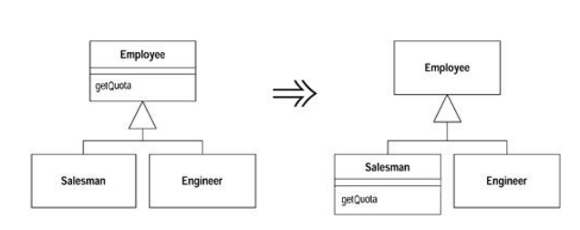
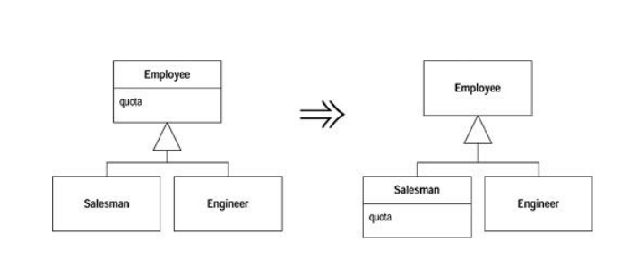
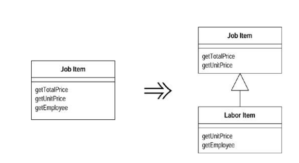
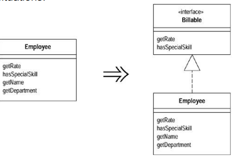
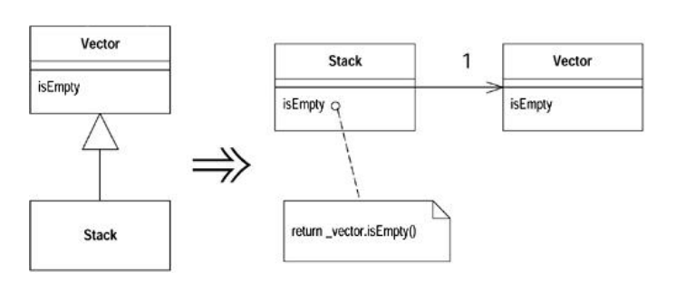

# Refactoring

The process of changing a software system in such a way that ==does not alter external behaviour of the code== but improves its internal structure.

A discipline to clean up code, a more effective designs.

#### Steps to refactor

1. Add new methods and classes
2. Move attributes and methods from one class to another
3. Rename the methods.

**<u>Refactor occurs continuously during the development</u>**

#### When to refactor

- Every couple of months
- When you add a function
- When you need to fix a bug
- When you do a code review

#### When shouldn’t refactor

- When existing code is such a mess it is easier to rewrite
- **Avoid refactoring when you’re close to project deadline**


## Type of refactoring

#### Code refactoring

- Delete commented code
- Delete Dead functions - never called functions
- Class with wrong hierarchy (refused bequest)
- Duplication code
- Magic numbers in code

#### Design refactoring

- Code at wrong level of Abstraction
- Feature Envy: a method interested in variables, methods of other classes.
- Vertical Separation: Defining variables and methods many lines away from their first use
- Inconsistency - doing things differently
- Reduce classes from large to small.

## Antipattern

- Common response to recurring problem that is usually ineffective and risks being highly counterproductive.
- For Example:
  - Hard coding instead of generic
  - Spaghetti code.

## Refactoring methods

Some of the methods like:

- Composing Methods
- Moving Features between object
- Organizing Data
- …


### 1. Composing method

To deal with problems such as **long methods and temporary variables which makes the method too long to follow**

- Extract Method
- Introduce Explaining Variable
- Split Temporary Variable

#### Extract Method

Instead of commenting, makes a method that do it with a proper name:

Instead of this:

```java
...
    // print info
    System.out.println("something");
...
```

Do this:

```java
void printInfo() {
    System.out.println("Information");
}
```

> This is to:
>
> - Improve code clarity
> - Short methods are more likely to be reused
> - Makes reading and understanding higher level methods easier
> - Attention must be paid to any variables used in extracted code.

#### Introduce Explaining Variable

Breaking a complicated expression into parts that explain the meaning

Instead of this:

```java
if (a1 > a2 && exam > examin && overall >= overallmin) {
    ....
}
```

Do this:

```java
final boolean PassAssignHurdle = a1 > a2;
final boolean PassExHurdle = exam >= Examin;
final boolean PassOverall = overall >= overallmin

if (PassAsignHurdle && PassExHurdle && PassOverall) {
	...
}
```

#### Split Temporary Variable

If a temporary variable is used more than one, make sure you have to rename it each time

Instead of:

```java
double myScore = 12 * 40;
System.out.println(myScore);

myScore = 14 * 2;
System.out.println(myScore);
```

Do this:

```java
double myscore = ...;
System.out.println(myScore);

double bonusCore = ...;
System.out.println(bonusScore);
```

### 2. Moving Features between Objects

Some of the design decisions can be corrected with refactoring:

- Move Method
- Move Field
- Extract class
- Incline class
- Hide Delegate

#### Move Method

Move a method when it will be used by more features from another class

> Reduces coupling by reducing the amount of collaboration
>
> New code must be adjusted to take into account references and exceptions
>
> If references are involved delegation, may be easier than removing it altogether

#### Move field

Move a field when it will be used by more features from another class

It requires updating references to the old fields

#### Extract class

When a class has too many methods and data create a new class and move the necessary methods and fields

- Decide how to split the responsibilities
- Create a new class with the split-off responsibilities
- Use Move methods and Fields as necessary

> Classes often grow over time,, often become too complicated
>
> A class with many operation and data is not cohesive
>
> You may consider data and methods that go together or change together

#### Inline class

Reverse of extract class

Use when a class need not exist anymore



#### Hide delegate

To avoid client calling server’s delegate class create additional methods on the server

> **Delegate class**: which is a data structure that refers to a static method or to a class instance and an instance method of that class.

Promotes encapsulation



> Encapsulation, reduce effect of change
>
> Avoid client’s access.

##### Problem with delegate

Every method in delegate will need a middle man, which might be too costly.

##### Introduce Foreign Method

Useful when you are not allowed to change the server class (such as Date) to add additional services (get next date)

Such service can be hard coded in the client but if such a service is used repetitively, it can be added to the client.

```java
Date newStart = new Date(previousEnd.getYear(), previousEnd.getMonth(), previousEnd.getDate() + 1);

Date newStart = nextDay(previousEnd);
private static Date nextDay(Date arg) {
    return new Date(arg.getYear(), arg.getMonth(), arg.getDate() + 1);
}
```

##### Introduce Local Extension

If you need many additional foreign methods for a server class (that you cannot alter) create a subclass or wrapper class for it

This allows all the data and methods to be packaged together.



### 3. Dealing with Generalisation

Generalisation requires moving methods and fields around reflecting the hierarchy

Generalisation may also require creating new classes during refactoring

When inheritance is not appropriate code can be refactored to use delegation

Some of the method:

- Pull up/ Push down field/method
- Extract Subclass/Superclass/Interface
- Replace inheritance


#### Pull Up Field

If two subclasses have the same field, move it to the super class.



#### Pull Up method

If two subclasses have the same method, move it to the super class.

#### Push Down method

if the behavior on super class is relevant to only some of its subclass, move to those.



#### Pull down field

If the field on super class is only used by some subclass, move it to those.



#### Extract subclass

If a class has features that are used only in some instances create a subclass for the subset of features.




#### Extract superclass

When you have two classes with similar features move the common features to the super class.


#### Extract interface

When  two or more classes have part of their interface in common or only a subgroup of responsibilities is used by other classes extract the subset into an interface.



#### Replace inheritance with delegation

When a subclass uses only part of a superclass interface create a field to refer to the superclass through which its methods can be called (and remove the subclassing)



