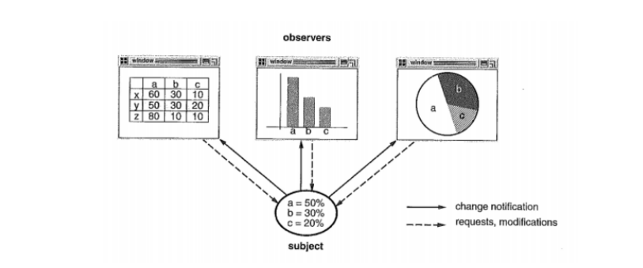
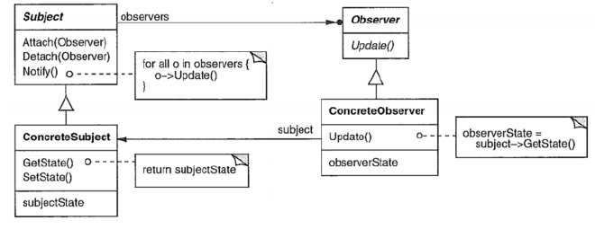
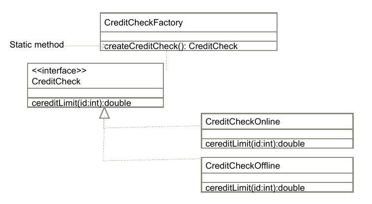
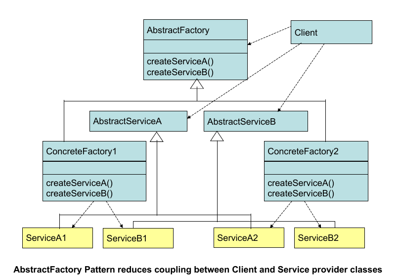
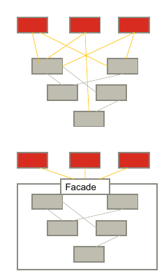
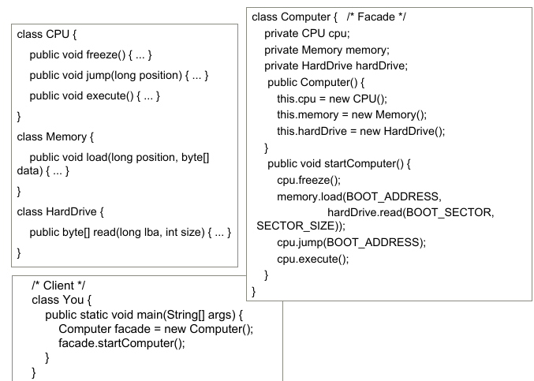
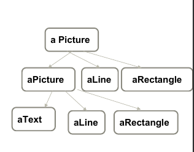
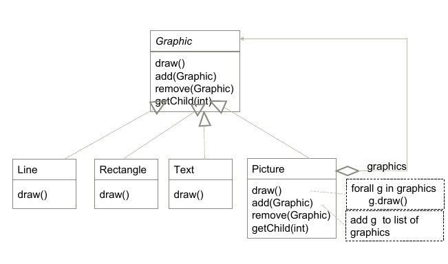
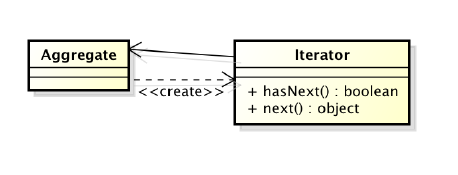

# Design Patterns and Principles

## Design characteristic

| Name                       | Definition                                                   |
| -------------------------- | ------------------------------------------------------------ |
| **Coherence**              | **Logical structure**, elements **working together to form a whole** |
| **Cohesion**               | Functions **strongly related together**                      |
| **Consistency**            | Consistent                                                   |
| **Coupling**               | to **what extent do changes one affect the other**           |
| **Extensibility**          | will it be easy to extend?                                   |
| **Functional flexibility** | How **open is the system** to **supporting changes** to function |
| **Generality**             | Are mechanisms and **decisions as general as practicable?**  |
| **Inter dependency**       | **What proportion** of processing steps **involves interactions between elements?** (not within an element) |
| **Separation of concerns** | Are **internal elements responsible** **for distinct parts of system’s operation** |
| **Simplicity**             | Is the design solutions used the **simplest one?**           |


### Design smells

| name                    | definition                                                   |
| ----------------------- | ------------------------------------------------------------ |
| **Rigidity**            | The system is hard to change because **changes in one part will lead to change in other parts** (high coupling) |
| **Fragility**           | The system may **break in in multiple places** due to change in one place |
| **Immobility**          | Parts **could be useful in other systems**, but separating has high risk. |
| **Viscosity**           | Doing things right **is harder** than doing things wrong: <br />- **Design-preserving methods are more difficult to use** than the hack.<br />- **Development environment is slow and inefficient** |
| **Needless complexity** | **contains element** that **aren’t currently useful**        |
| **Needless repetition** | System has lots of repeated code elements                    |
| **Opacity**             | System or parts is **hard to read and understand**           |

### Desirable Design Characteristics

… refer to [W8-lec6a](W8-lec6a.md)

### Solid principle

… refer to [W8-lec6a](W8-lec6a.md)


## Design Patterns

### Benefits

1. Support reuse
2. Communicate successful designs
3. Narrow design space
4. Focus on design what have been **proven to work**
5. promote good practice
6. leverage and build on best practice and expertise.

### Essentials Elements of Design patterns

1. Pattern name: increase vocabulary of designers
2. Problem / Motivation: intent, context, when to apply
3. Solution: UML-like structure, abstract code
4. Consequences: results and tradeoffs.


## Observer pattern

> Need to maintain consistency between related objects without coupling them tightly.
>
> E.g: When you want to update multiple views when the data changes.

Example (Change the charts based on data)




### Solution

The data can have any number of registered `Observers`. All `observers` are notified when the data’s state changed.

`Observers` can also query the data’s current state.

### Applicability

Apply when:

- you want one element to depend on the others
- a change to one object requires a change to the others
- when you don’t want to be tightly coupled

### Participants

> Some of the terms for observer

| Name                 | Function                                                     |
| -------------------- | ------------------------------------------------------------ |
| **Subject**          | knows the `observer`, provides an interface for attaching (add) and  detaching (remove) `observer `object. e.g: data. |
| **Observer**         | defines an updating interface for objects that need to be notified of changes. |
| **ConcreteSubject**  | Store the state of interest to `ConcreteObserver` objects. Sends notification to its observers when state changes. |
| **ConcreteObserver** | Maintains a reference to `ConcreateSubject` object. **Store states that should stay consistent with subjects**. Implement `Observer` updating interface |

### Structure



> Observers doesn’t know anything about the others, they just knows when to update themselves
>
> Attach will add the `Observer` to the `Array`. Detach will pop it out.
>
> `Observer` is an interface.

### Sample Code (not asked to do)

This code uses `java.util.Observer/Observable`

ConcreteSubject:

```java
public class WeatherStation extends Observable {
    ...
    public void setState(Integer temp) {
        this.state = state;
        setChanged();
        notifyObservers(getState());
    }
}
```

Observer:

```java
public class WeatherConverter implements Observer {
    public void update(Observable subject, Object state) {
        System.out.println("Temperature in F" + celsiusToF(state));
    }
}
```

Test Program:

```java
Subject subject = new Subject();
subject.addObserver(new WeatherConverter());
subject.addObserver(new WeatherIntepreter());
subject.setState(28);
...
subject.setState(10);
```

### Consequences

1. Abstract coupling between Subject and Observers
2. Support for broadcast communication
3. Unexpected updates

### Implementation

1. Mapping subjects to their observers; how to store
2. Observing more than one subject
3. Who triggers: `Subject` or `Observer`
4. Dangling references[^1] to deleted subjects
5. Ensuring subject state is self-consistent before notification
6. Avoiding observer-specific updates: push vs pull
7. Specifying updates of specific interest

[^1]: A **dangling reference** is a **reference** to an object that no longer exists. Garbage is an object that cannot be reached through a **reference**. **Dangling references** do not exist in garbage collected languages because objects are only reclaimed when they are no longer accessible (only garbage is collected).

## Types of patterns

| Creational       | Structural       | Behavioural             |
| ---------------- | ---------------- | ----------------------- |
| Abstract Factory | Adapter (object) | Chain of responsibility |
| Builder          | Bridge           | Command                 |
| Prototype        | Composite        | Iterator                |
| Singleton        | Decorator        | Mediator                |
| Factory Method   | Facade           | Memento                 |
|                  | Flyweight        | Observer                |
|                  | Proxy            | State                   |
|                  |                  | Strategy                |
|                  |                  | Visitor                 |

### Creational patterns

!> This is just a quick summary of what it does for review. For details go to [here](#1.-Creational-Patterns).

#### Singleton

The entire class only has one instance, with a global point of access

#### Abstract factory

Gives an `interface` for creating families of dependent objects

#### Builder

**Separate the construction of a complex object from its representation** so that **the same construction can create different representations.**

#### Factory Method

It defines an interface for creating an object. **but let subclasses decide which class to instantiate**

#### Prototype

Create a prototypical instance from an object, and create new object by copying this prototype.

### Structural Patterns

#### Adapter

Convert the **interface** of a class **into another interface** clients expected

#### Bridge

Decouple an abstraction from its implementation so that the two can vary independently

#### Composite

Compose objects into tree structures to represent whole-part hierarchies. This patterns lets clients treat individual objects & object compositions[^2] uniformly.

[^2]: Object composition is a way to combine objects or data types into more complex ones.

#### Decorator

Attach additional responsibilities to an object dynamically. Decorators provide a flexible alternative to subclassing for extending functionality.

#### Facade

Provide a unified interface to a set of interfaces in a subsystem. **Defines a higher-level interface that makes the subsystem easier to use.**

#### Flyweight

Use sharing to support large numbers of fine-grained objects[^3] efficiently

[^3]: More objects each holding less data

#### Proxy

Provide a placeholder for another object to control access to it

### Behavioral Patterns

#### Chain of Responsibility

Avoid coupling the sender of a request  to its receiver by giving more than one object a chance to handle the request. Chain the receiving objects and pass the request along the chain until an object handles it.

#### Command

**Encapsulate a request as a object**, there by letting you parameterize clients with different requests, queue or log request, and support undoable operations.

#### Interpreter

Given a language, define a representation for its grammar along with an interpreter

#### Interator

Provide a way to access the elements of an aggregate object[^4] without exposing its underlying representation

[^4]: Aggregate object is one which contains other object

#### Mediator

Define an object that encapsulates how a set of objects interact. Promotes **loose coupling** by keeping objects from referring to each other explicitly.

#### Memento

Without violating encapsulation, **capture** and externalize an **object’s internal state** so that the **object can be restored to this state later.**

#### Observer

Define a one-many dependency between objects so that one object changes state, all its dependants are notified

#### State

Allow an object to alter its behaviour when its internal state changes. The object will appear to change its class

#### Strategy

Define a family of algorithms, encapsulate each one, make them interchangeable. Strategy lets the algorithm vary independently from clients that use it.

#### Template Method

Define the skeleton of an algorithm in an operation, deferring some steps to subclasses. Template method lets subclasses redefine certain steps of an algorithm without changing the algorithm’s structure.

#### Visitor

Represent an operation to be performed on the elements of an object structure. Visitor lets you **define a new operation without changing the classes of the elements on which it operates.**

# 1. Creational Patterns

- Creational design process abstract the instantiation process - decouples the clients from the way objects are created composed and represented
- Creational patterns gives flexibility in what get created, who creates it, how it is created and when it is created.

## Singleton

> **Purpose**: 
>
> To ensure that a class only has one instance
>
> **Application**:
>
> It’s important for some classes to have only one instance (file system, window manager)
>
> It ensures that class only has one instance and the instance is easily accessible
>
> **Consequences:**
>
> <u>Pros</u>
>
> - Reduce namespace pollution
> - Make it easy to change your mind and allow more than one instance
> - Allow extension by subclassing
>
> <u>Cons</u>
>
> - Drawbacks on global if misused
> - Implementation may be less efficient than a global
> - Concurrency pitfalls
>
> **Implementation**
>
> - Lazy creation of object possible if large / inefficient

Code Example:

```java
class Singleton {
    private static Singleton uniqueInstance;
    private Singleton() { }
    public static Singleton getInstance() {
        if(uniqueInstance == null) {
            uniqueInstance = new Singleton();
        }
        return uniquerInstnace;
    }
}
```


## Factory

> Factory is an object responsible for creating one or more objects for the client
>
> Factory provides the objects that meet interface but client doesn’t know concrete class of that object.
>
> Static factory method:
>
> - Coding technique
> - Class-level method, returns an instance

### Factory Method

Factory method creates and returns an object of some concrete type that implements the interface

The iterator pattern in Java provides a way to access the elements of a collection sequentially using the factory method `iterator()` (The caller does not need to specify the concrete type of the iterator)

The type can be changed from platform to platform without affecting existing client code

The factory method makes it unnecessary for clients to know all the creation details (classes, parameters)

Example:

- Suppose a company wants to check with the credit agency to determine the credit limit to be allowed for customers
- It’s possible the credit agency may be offline at times.
- In such cases, the credit limit is to determined using a series of questions in a dialog
- To handle these cases, the `CreateCheckFactory` class will create either `CreateCheckOnline` or `CreateCheckOffline` objects both of which implement the method `creditLimit()` depends on the situation.



> It always return the object of the right type

### Abstract factory pattern

**Problems:**

Can we shield clients using different platforms from implementation details for various products


**Solution**

Represent each concept (menu, button,..) using `AbstractServices`. An `AbstractFactory` class declares methods for creating such services. A specific platform is then realized using `ConcreteFactory` and `ConcreateService` object



> Create different classes based on client system. For example windows, OSX buttons


**Consequence**

- Helps to isolate concrete classes. Client manipulate instances through their abstract interfaces
- It makes exchanging product families easy - as the concrete factory appears only once in an application
- Promotes consistency products - product objects in a family are designed to work together.

# 2. Structural patterns

- Structural patterns are concerned with how classes and objects are composed to form larger structures
- Structural  class patterns combined two or more classes. For example the class form of Adapter pattern derives a new class from two or more base classes.
- Structural object patterns describe ways to compose objects to realize new functionalities.
- Composite is an example of structural object pattern. It allows one to compose primitive and other composite objects into arbitrarily complex structures.

## Facade

**Intent**

- Provide a unified interface to a set of interfaces in subsystem

**Motivation**

- Structuring a system into subsystem helps reducing complexity
- Aims to minimize the communication and dependencies between sub systems.



**Applicability**

- Subsystem tend to get more complex as they evolve. Thus facade will provide a simple default view of the system that is good enough for most client
- The subsystem can be decoupled from clients thereby making them more portable
- Allows additional layer to be created between clients and subsystems.

Code Example:



**Consequences**

- Shield clients from subsystem components - reducing the number of objects clients deal with
- This allows components of the subsystems to be changed without affecting the clients
- Does not prevent clients using subsystem classes if they need to.


## Composition pattern

**Intent**

Compose objects **into tree structures** to represent part-whole hierarchies

Allows clients to treat individual objects and composition of objects uniformly

**Motivation**

Building complex objects can be made simpler if an abstract class can be used to represent both primitives and containers.




Example:



> All root from one object.

**Consequences**

- Define class hierarchies consiting of primitive objects and composite objects. Complex objects can be created can recursively composing
- Makes the client code simple as composite structures and primitives can be treated uniformly
- Makes it easier to add new types of components - Clients need not to be changed

# 3. Behavioural Patterns

## Iterator Pattern



- Requires no knowledge of aggregate structure
  - Can use same interface to traverse linked list, array even tree
- Can provide multiple iterators for the same aggregate
  - Iterator, ReverseIterator, FilterIterator,…

Example:

```java
public class CustomList implements Iterable<Object> {
    public Iterator<Object> iterator() {
        return new CustomIterator(this);
    }
    public class CustomIterator implements Iterator<Object> {
        public boolean hasNext() {...}
        public Object next() { ... }
        public void remove() { ... }
    }
}
```

Then

```java
void processsObject(CustomList objects) {
    for (Object obj : objects)
        processObject(obj)
}
// or
void processObject(CustomList objects) {
    Iterator it = objects.iterator();
    while()
}
```

