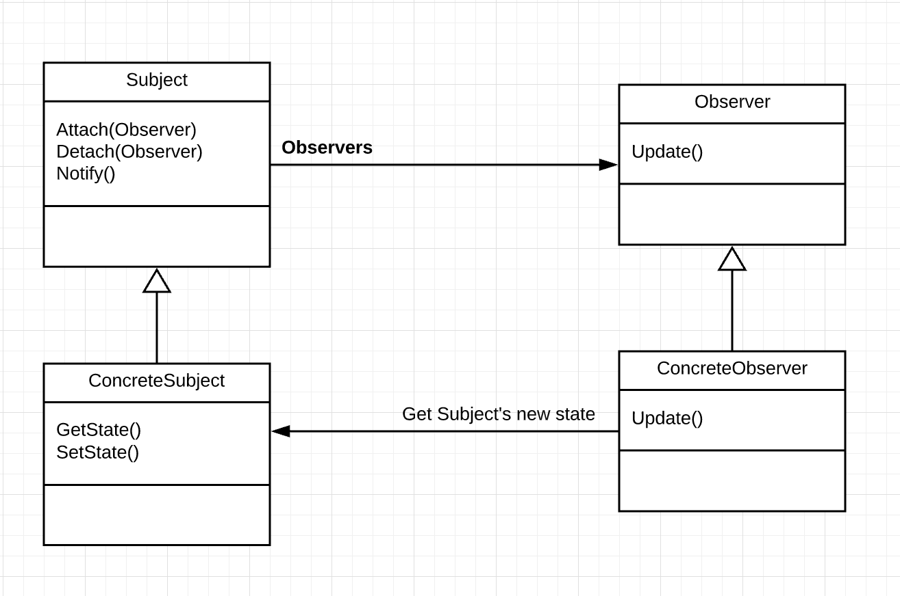
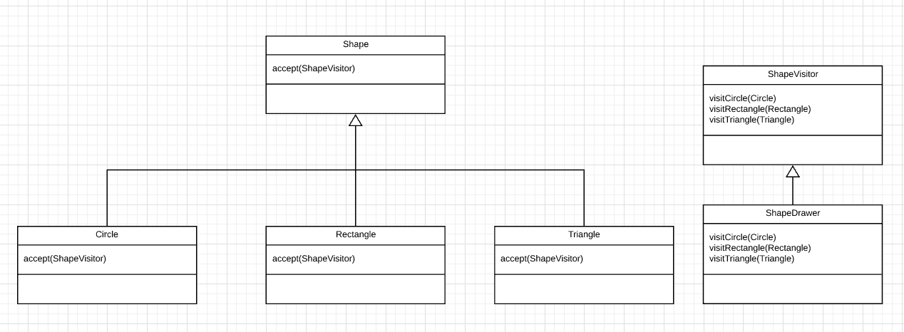

# Misc

## Git conflict syntax

```java
public class gitConflict {
<<<<<<< HEAD
  private String name;
=======
  private String myName;
>>>>>>> INCOMING_CHANGE
}
```

?> There are **7** characters of `>`, `=`, `<`. To resolve just simply remove the gitconflict syntax.


## JUNIT 4 vs 5

| JUnit 4      | JUnit 5     |
| ------------ | ----------- |
| @BeforeClass | @BeforeAll  |
| @Before      | @BeforeEach |
| @AfterClass  | @AfterAll   |
| @After       | @AfterEach  |

`@Before`, `@After` will run before, after each `@Test` 

`@BeforeClass` and` @AfterClass` only run once.


## Using Iterator

```java
public class IteratorExample {
  private ArrayList arr = new ArrayList();
 	fillMyArray(arr);
  
  Iterator itr = arr.iterator();
  while(itr.hasNext()) {
    Object element = itr.next();
    System.out.println(element);
  }
}
```

!> Iterator mostly use when you **want to modify while you iterating through the array content**

👀​ **An example of iterating while modifying:**

```java
public class IteratorExample {
  private ArrayList arr = new ArrayList();
 	fillMyArray(arr);
  
  ListIterator litr = arr.listIterator();
  while(litr.hasNext()) {
    Object element = litr.next();
    System.out.println(element);
  }
}
```

---

Mock exam question:

*3.2 A programmer built a container class that allows you to store strings. Write an iterator that allows other classes to get access to all of the strings in a container object*

**Answer**: *Note that the answer is only subjective*

```java
public class CustomIterator implements Iterable<Object> throws NullPointerException {
    private Container data;
    
    public CustomIterator(Container container) {
        this.data = container;
    }
    
    public Iterator<Object> iterator() {
     	return data.iterator();   
    }
}
```

Other class can implement like this:

```java
public class AnotherClass {
    private Container container = new Container();
    
    fillContainer(container);
    
    ...
        
   	public void printContainer() {
        CustomIterator helper = new CustomIterator(container);
        Iterator itr = helper.iterator();
        
        while(itr.hasNext()) {
            System.out.println(itr.next());
        }
    }
}
```

<u>If you also want to customize the iterator class:</u>

```java
public class CustomIterator implements Iterable<Object> throws NullPointerException {
    
    private Container data;
    
    public CustomIterator(Container container) {
        this.data = container;
    }
    
   	public Iterator<Object> iterator() {
        return new MyIterator();
    }
}
```

```java
public class MyIterator implements Iterator<Object> {
    public boolean hasNext() { ... }
    public Object next() { ... }
    public boolean hasPrevious() { ... }
    public void remove() { ... }
}
```

!> You can also use `for (Object obj : objects)` to iterate through the iterator but however you won't be able to modifying while looping.

## Mock object with JUnit

```java
public class MockUser implements User {
    public String username;
    public String password;
    
    ...
        
    public boolean isUserValid(String username, String password) {
       	this.username = username;
        this.password = password;
        return authorize(username, password);
    }
}
```

```java
@Test(expected=NullPointerException.class)
public class TestLogin {
    Mockuser test = new MockUser("Don", "123456");
    assertTrue("User should log in", test.isUserValid("NotDon", "22222"));
}
```

>   The example is using `NullPointerException.class` which is optional.
>
>   The first parameter of of `assertTrue` is for message.


## More on asserting and logging

**Documentations:**

-   Assert: http://junit.sourceforge.net/javadoc/org/junit/Assert.html
-   Logger: https://devdocs.io/openjdk~8/java/util/logging/logger

```java
public class AssertingWithLogging {
    private static final Logger logger = Logger.getLogger();
    private Calculator calc;
    
    @BeforeClass
    public void setupEnvironment() {
        logger.info("Setting up testing environment");
        calc = new Calculator();
    }
    
    @Before
    public void initState() {
        logger.warning("Resetting calculator state");
        calc.clear();
    }
    
    @Test
    public void additionTest() {
        logger.log(Level.INFO, "Testing for addition");
        // Another way to use logging
        
        int expected = 6;
        int test = calc.add(3,3);
        assertEquals("Addition should be correct", expected, test);
    }
    
    @Test(expected = NullPointerException.class)
    public void getResult() {
        logger.warning("Getting previous results");
        assertNotNull("Previous result should not be null", calc.previousResult());
    }
    ....   
}
```

!> Note that with logger, **only log with `info` or worst** will be log by default. Which means that **fine, finer, finest** by default won't be logged.


## Simple Observer Pattern graph and code

**Reference**: https://dzone.com/articles/observer-pattern-java



?> Think of Observer Pattern as a pub sub model. All of the Observer can subscribe/unsubcribe to a observerable. **In the lecture note, subject is an observable**. 

For a better understanding, Think of *ConcreteSubject* as the *WH1000XM3B Headphone*. Everyone (*Observers*) wants to subscribe to this headphone for new deals.

Observer in here will be the user. When the state of the headphone change - *For example, restock, on sale, ...* - it will notify all of the *ConcreteObserver* (User). 

Thus the User will call the Update Method.

Example of the notify method

```java
public class Subject implements Observable {
    ...
    public void notify() {
        for(Observer user : users) {
            user.update();
        }
    }
} 
```


## Simple vistor pattern



```java
public interface ShapeVistor {
    public void visitCircle(Cirlce circle);
    public void visitRectangle(Rectangle rectangle);
    public void visitTriangle(Triangle triangle);
}

public class ShapeDrawer {
    public void visitCircle(Circle circle) {
        draw(circle);
    }
    
    public void visitRectangle(Rectangle rectangle) {
        draw(rectangle);
    }
    
    public void visitTriangle(Triangle triangle) {
        draw(triangle);
    }
}

public class Circle implements Shape {
    public void accept(ShapeVisitor visitor) {
        visitor.visitCircle(this)
    }
}

public class Rectangle implements Shape {
    public void accept(ShapeVisitor visitor) {
        visitor.visitRectangle(this)
    }
}
```

